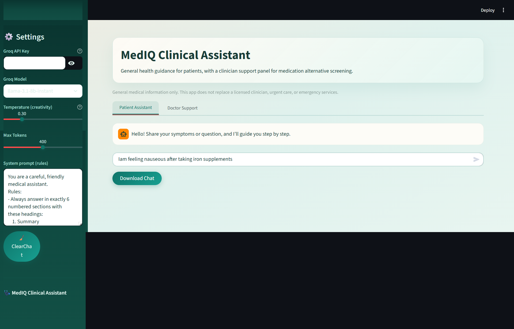
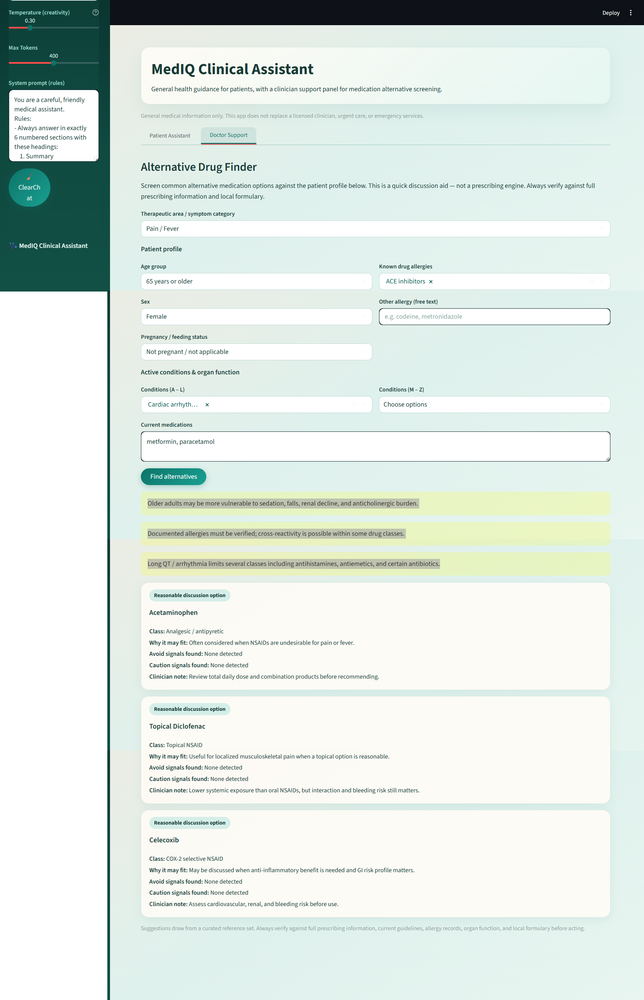

# MedIQ Clinical Assistant

An AI-powered medical information app built with **Streamlit** and **LangChain + Groq**, split into two purpose-built tabs.

---

## Features

### Patient Assistant tab
- Chat interface powered by **Llama 3.1** (via Groq API).
- Responses are always structured into **6 sections**: Summary, Common Causes, Safe Home Remedies, Prevention Tips, Medication Advice, Doctor Visit Advice.
- Adjustable temperature and token budget from the sidebar.
- Download full conversation as a `.txt` file.

### Doctor Support tab — Alternative Drug Finder
- Structured patient profile form (age group, sex, pregnancy/breastfeeding status, known allergies, active conditions).
- Select a **therapeutic area** from 13 categories:
  Pain/Fever · Allergic Rhinitis · Acid Reflux · Nausea · Cough/Cold · Hypertension · Type 2 Diabetes · Anxiety/Insomnia · Depression · Asthma/COPD · Constipation · Urinary Symptoms/BPH · Anticoagulation
- The tool screens a curated drug reference set against the patient's conditions and flags each alternative as **Reasonable**, **Use Caution**, or **Avoid**, with a plain-English clinician note for each.
- Global alerts fire automatically for high-risk signals (pregnancy, CKD, liver disease, anticoagulation, elderly, etc.).

> **Disclaimer:** This app provides general information only. It is not a prescribing engine and does not replace clinical judgment, full prescribing information, or emergency medical services.

---

## Screenshots

### Patient Assistant


### Doctor Support — Alternative Drug Finder

---

## Stack

| Layer | Technology |
|---|---|
| UI | Streamlit |
| LLM | Llama 3.1 8B via Groq API |
| Orchestration | LangChain (ChatGroq) |
| Drug logic | Rule-based Python module (`drug_support.py`) |

---

## Quick Start

```bash
pip install -r requirements.txt
streamlit run app.py
```

Open **http://localhost:8501**, paste your [Groq API key](https://console.groq.com) in the sidebar, and start chatting.
